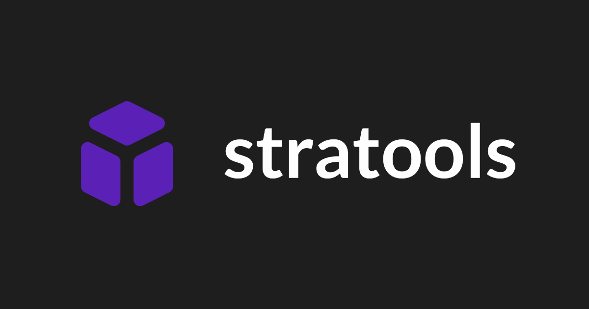

<div id="top"></div>
<br />

<div>
  <a href="https://tools.huffmanks.com">
        
    </a>
    <p>
    <br />
        Tools to help speed the web development process.
        <br />
        <br />
        <a href="https://tools.huffmanks.com">View Demo</a>
        ·
        <a href="https://github.com/huffmanks/tools-nextjs/issues">Report Bug</a>
        ·
        <a href="https://github.com/huffmanks/tools-nextjs/issues">Request Feature</a>
    </p>

</div>

<br />
<br />

<!-- TABLE OF CONTENTS -->
<details>
  <summary>Table of Contents</summary>
  <ol>
    <li><a href="#about-the-project">About The Project</a></li>
    <li><a href="#built-with">Built With</a></li>
    <li><a href="#getting-started">Getting Started</a></li>
    <li><a href="#instructions">Instructions</a></li>
    <li><a href="#roadmap">Roadmap</a></li>
  </ol>
</details>
<br />

<!-- ABOUT THE PROJECT -->

## About The Project

I built these tools to help speed my development process.

<br />

### Color Picker


[Google Color Picker](https://www.google.com/search?q=color+picker)
\
[Stratools Color Picker](https://tools.huffmanks.com/picker/color)

-   Option to copy any code not just HEX.
-   Similar shades displayed so I could pick lighter/darker versions.

<br />

### Unit Calculator


[Google Unit Calculator](https://www.google.com/search?q=unit+converter)
\
[Stratools Unit Calculator](https://tools.huffmanks.com/calculate/units)

-   Wanted all the units to be displayed so I could see the differences.

<p align="right">(<a href="#top">back to top</a>)</p>

<!-- BUILT WITH -->

## Built With

-   [Next.js](https://nextjs.org/)
-   [MUI](https://mui.com/)
-   [change-case](https://www.npmjs.com/package/change-case)
-   [colord](https://www.npmjs.com/package/colord)
-   [convert](https://www.npmjs.com/package/convert)
-   [react-colorful](https://www.npmjs.com/package/react-colorful)

<p align="right">(<a href="#top">back to top</a>)</p>

<!-- GETTING STARTED -->

## Getting Started

To get a local copy up and running follow these simple example steps.

1. Clone the repo
    ```sh
    git clone https://github.com/huffmanks/tools-nextjs.git
    ```
2. Install NPM packages
    ```sh
    yarn
    ```

<p align="right">(<a href="#top">back to top</a>)</p>

<!-- INSTRUCTIONS -->

## Instructions

### Stratools Unit Calculator

BASE_URL = https://tools.huffmanks.com/calculate/units

#### Query params

```
/?type=length&num=3&unit=kilometer
```

```
/?t=len&n=3&u=km
```

```
/?t=2&n=3&u=5
```

All three of these examples get the same result.

<br />

| Parameter     | Type                 | Description       | Example   |
| :------------ | :------------------- | :---------------- | :-------- |
| `type` OR `t` | `string` OR `number` | Measurement types | length, 2 |
| `num` OR `n`  | `number`             | Number to compare | 4         |
| `unit` OR `u` | `string` OR `number` | Unit to select    | km, 5     |

<br />

The string can be any variant of the word. i.e. kilometers, kilo, km, etc.

<br />

<details>
  <summary>Measurement types</summary>
  <ol>
    <li><a href="#digital-storage">Digital Storage</a></li>
    <li><a href="#length">Length</a></li>
    <li><a href="#volume">Volume</a></li>
    <li><a href="#temperature">Temperature</a></li>
    <li><a href="#time">Time</a></li>
    <li><a href="#weight">Weight</a></li>
  </ol>
</details>

<br />

### Digital Storage

type=1

<table>
    <tbody>
        <tr>
            <th width="130">Unit</th>
            <th width="40">Number</th>
            <th width="50">Short</th>
        </tr>
        <tr>
            <td>terabytes</td>
            <td align="center">1</td>
            <td align="center">TB</td>
        </tr>
        <tr>
            <td>gigabytes</td>
            <td align="center">2</td>
            <td align="center">GB</td>
        </tr>
        <tr>
            <td>megabytes</td>
            <td align="center">3</td>
            <td align="center">MB</td>
        </tr>
        <tr>
            <td>kilobytes</td>
            <td align="center">4</td>
            <td align="center">KB</td>
        </tr>
        <tr>
            <td>bytes</td>
            <td align="center">5</td>
            <td align="center">B</td>
        </tr>
    </tbody>
</table>

<br />

### Length

type=2

<table>
    <tbody>
        <tr>
            <th width="130">Unit</th>
            <th width="40">Number</th>
            <th width="50">Short</th>
        </tr>
        <tr>
            <td>miles</td>
            <td align="center">1</td>
            <td align="center">mi</td>
        </tr>
        <tr>
            <td>yards</td>
            <td align="center">2</td>
            <td align="center">yd</td>
        </tr>
        <tr>
            <td>feet</td>
            <td align="center">3</td>
            <td align="center">ft</td>
        </tr>
        <tr>
            <td>inches</td>
            <td align="center">4</td>
            <td align="center">in</td>
        </tr>
        <tr>
            <td>kilometers</td>
            <td align="center">5</td>
            <td align="center">km</td>
        </tr>
        <tr>
            <td>meters</td>
            <td align="center">6</td>
            <td align="center">m</td>
        </tr>
        <tr>
            <td>centimeters</td>
            <td align="center">7</td>
            <td align="center">cm</td>
        </tr>
        <tr>
            <td>millimeters</td>
            <td align="center">8</td>
            <td align="center">mm</td>
        </tr>
        <tr>
            <td>pixels</td>
            <td align="center">9</td>
            <td align="center">px</td>
        </tr>
    </tbody>
</table>

<br />

### Volume

type=3

<table>
    <tbody>
        <tr>
            <th width="130">Unit</th>
            <th width="40">Number</th>
            <th width="50">Short</th>
        </tr>
        <tr>
            <td>US liquid gallons</td>
            <td align="center">1</td>
            <td align="center">gal</td>
        </tr>
        <tr>
            <td>US liquid quarts</td>
            <td align="center">2</td>
            <td align="center">qt</td>
        </tr>
        <tr>
            <td>US liquid pints</td>
            <td align="center">3</td>
            <td align="center">p</td>
        </tr>
        <tr>
            <td>US legal cups</td>
            <td align="center">4</td>
            <td align="center">c</td>
        </tr>
        <tr>
            <td>US fluid ounces</td>
            <td align="center">5</td>
            <td align="center">oz</td>
        </tr>
        <tr>
            <td>US tablespoons</td>
            <td align="center">6</td>
            <td align="center">tbsp</td>
        </tr>
        <tr>
            <td>US teaspoons</td>
            <td align="center">7</td>
            <td align="center">tsp</td>
        </tr>
        <tr>
            <td>liters</td>
            <td align="center">8</td>
            <td align="center">L</td>
        </tr>
        <tr>
            <td>milliliters</td>
            <td align="center">9</td>
            <td align="center">mL</td>
        </tr>
    </tbody>
</table>

<br />

### Temperature

type=4

<table>
    <tbody>
        <tr>
            <th width="130">Unit</th>
            <th width="40">Number</th>
            <th width="50">Short</th>
        </tr>
        <tr>
            <td>celsius</td>
            <td align="center">1</td>
            <td align="center">C</td>
        </tr>
        <tr>
            <td>fahrenheit</td>
            <td align="center">2</td>
            <td align="center">F</td>
        </tr>
        <tr>
            <td>kelvin</td>
            <td align="center">3</td>
            <td align="center">K</td>
        </tr>
    </tbody>
</table>

<br />

### Time

type=5

<table>
    <tbody>
        <tr>
            <th width="130">Unit</th>
            <th width="40">Number</th>
            <th width="50">Short</th>
        </tr>
        <tr>
            <td>years</td>
            <td align="center">1</td>
            <td align="center">yr</td>
        </tr>
        <tr>
            <td>months</td>
            <td align="center">2</td>
            <td align="center">mo</td>
        </tr>
        <tr>
            <td>weeks</td>
            <td align="center">3</td>
            <td align="center">wk</td>
        </tr>
        <tr>
            <td>days</td>
            <td align="center">4</td>
            <td align="center">d</td>
        </tr>
        <tr>
            <td>hours</td>
            <td align="center">5</td>
            <td align="center">hr</td>
        </tr>
        <tr>
            <td>minutes</td>
            <td align="center">6</td>
            <td align="center">min</td>
        </tr>
        <tr>
            <td>seconds</td>
            <td align="center">7</td>
            <td align="center">s</td>
        </tr>
        <tr>
            <td>milliseconds</td>
            <td align="center">8</td>
            <td align="center">ms</td>
        </tr>
    </tbody>
</table>

<br />

### Weight

type=6

<table>
    <tbody>
        <tr>
            <th width="130">Unit</th>
            <th width="40">Number</th>
            <th width="50">Short</th>
        </tr>
        <tr>
            <td>US tons</td>
            <td align="center">1</td>
            <td align="center">ton</td>
        </tr>
        <tr>
            <td>pounds</td>
            <td align="center">2</td>
            <td align="center">lbs</td>
        </tr>
        <tr>
            <td>ounces</td>
            <td align="center">3</td>
            <td align="center">oz</td>
        </tr>
        <tr>
            <td>kilograms</td>
            <td align="center">4</td>
            <td align="center">kg</td>
        </tr>
        <tr>
            <td>grams</td>
            <td align="center">5</td>
            <td align="center">g</td>
        </tr>
        <tr>
            <td>milligrams</td>
            <td align="center">6</td>
            <td align="center">mg</td>
        </tr>
    </tbody>
</table>

<br />

<p align="right">(<a href="#top">back to top</a>)</p>

<!-- ROADMAP -->

## Roadmap

-   [x] Aspect Ratio Calculator
-   [x] Color Picker
-   [x] Unit Calculator
-   [x] Email Signature
-   [x] Text Formatter
-   [x] Password Generator
-   [ ] Random Picker
    -   [x] Get random number(s) from a number range
    -   [ ] Pick a random item from a list
-   [ ] Todo/shopping list
-   [ ] Calculator
-   [ ] Keyboard shortcuts

\
\
See the [open issues](https://github.com/huffmanks/tools-nextjs/issues) for a full list of proposed features (and known issues).

Project Link: [https://tools.huffmanks.com](https://tools.huffmanks.com)

<p align="right">(<a href="#top">back to top</a>)</p>
